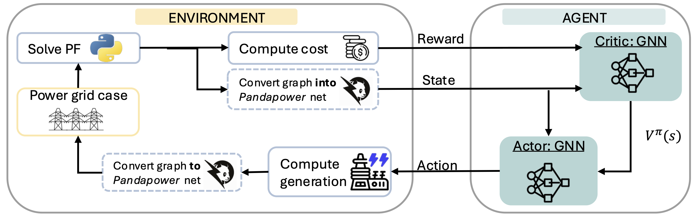
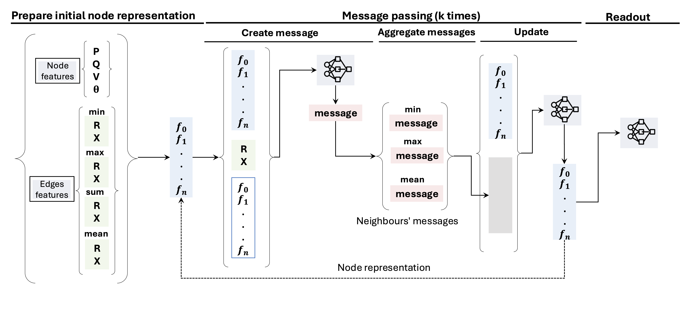
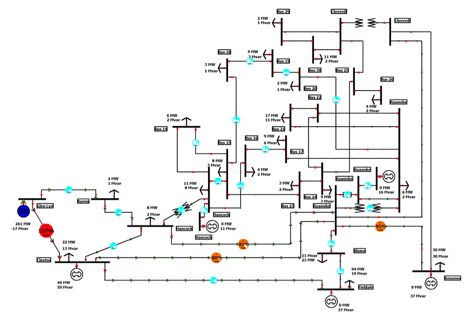

# opf_gnn_ppo
This work introduces a novel architecture that combines Proximal Policy Optimization (PPO) — a Deep Reinforcement Learning algorithm — with Graph Neural Networks (GNNs) to solve the Optimal Power Flow (OPF) problem in electrical grids.
Unlike traditional numerical solvers, which often fail to converge in large, nonlinear systems, our approach learns to minimize generation costs while generalizing to unseen grid topologies.


## Method
*Problem Statement*
Optimal Power Flow seeks to minimize generation cost subject to physical and operational constraints (voltage, load balance, etc.). The Alternating Current OPF (ACOPF) formulation is non-convex and computationally expensive, often simplified to the less accurate DCOPF.

*Approach*
We model the power grid as a graph:
* Nodes: buses (with voltage, phase angle, power injection)
* Edges: transmission lines (with resistance R and reactance X)


* Environment: simulated via pandapower, ensuring physical feasibility
Both actor and critic share the same GNN architecture (message passing + readout layers), differing only in their output heads.


<p align="center">
  
</p>

A PPO agent is trained to iteratively adjust generator outputs:
* Actor-GNN: learns a policy to select which generator to modify
* Critic-GNN: estimates the value of the current grid state

<p align="center">
  
</p>


### Training
* Dataset: IEEE 30-bus system
* Episodes: 500
* Optimizer: Adam (lr = 0.003)
Message iterations: 4
* Node embedding size: 16
* Reward: improvement in generation cost relative to previous timestep
* Frameworks: PyTorch, pandapower
After training, the agent can generalize to:
Networks with different load levels
Removed loads or lines, simulating real-world faults or maintenance

<p align="center">
  
</p>

## Usage

### Running a Single Experiment

To run a single experiment with default parameters:

```bash
python run.py
```

To customize parameters using gin configuration files:

```bash
python run.py --gin_files configs/general.gin configs/ppo.gin
```

To override specific parameters using gin bindings:

```bash
python run.py \
  --gin_bindings='Environment.env_type = "case30"' \
  --gin_bindings='Environment.env_number = 3' \
  --gin_bindings='PPOAgent.learning_rate = 0.003' \
  --gin_bindings='Actor.node_state_size = 16'
```

### Running Grid Search

To run multiple experiments with different parameter combinations:

```bash
python grid_search.py
```

The grid search script will automatically generate and execute multiple `run.py` commands with different parameter combinations. You can modify the parameter lists in `grid_search.py` to customize which combinations to test.

### Configuration

The project uses gin configuration files located in the `configs/` directory:
- `configs/general.gin`: General configuration parameters
- `configs/ppo.gin`: PPO-specific parameters

Key parameters you can customize:
- **Environment**: `env_type` (case30, case118), `env_number`, `reward_magnitude`, `reward_computation`
- **PPO Agent**: `learning_rate`, `batch_size`, `gamma`, `clip_param`, `epochs`
- **Actor/Critic**: `node_state_size`, `message_iterations`, `hidden_units_readout`, `dropout_rate`, `activation_fn`

## Citation

If you find this work useful for your research, please cite our paper:

```bibtex
@inproceedings{Lopez-Cardona2025Proximal,
  title     = {Proximal Policy Optimization with Graph Neural Networks for Optimal Power Flow},
  author    = {L{\'o}pez-Cardona, {\'A}ngela and Bern{\'a}rdez, Guillermo and Barlet-Ros, Pere and Cabellos-Aparicio, Albert},
  booktitle = {Proceedings of the 14th International Conference on Data Science, Technology and Applications - Volume 1: DATA},
  year      = {2025},
  pages     = {347-354},
  publisher = {SciTePress},
  isbn      = {978-989-758-758-0},
  issn      = {2184-285X},
  doi       = {10.5220/0013462700003967}
}
```